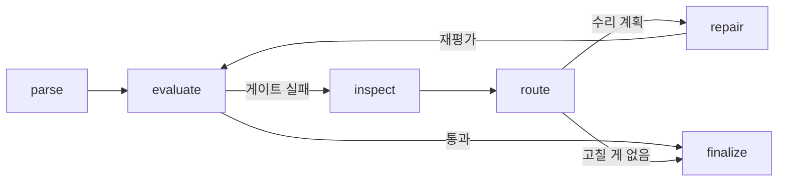
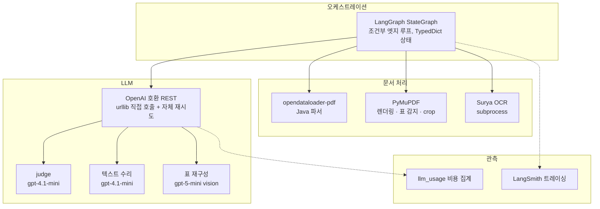

<p align="center">
  <a href="README.md">English</a> | <a href="README.ko.md">한국어</a>
</p>

<h1 align="center">난 파싱을 할테니, 당신은 다른거 신경써</h1>

<p align="center">파싱 결과를 스스로 채점하고, 고칠 가치가 있는 것만 고치고, 망치면 되돌리는 파싱 루프</p>

<p align="center">
  <a href="https://github.com/chaeminyoon/Parse-Everything/actions/workflows/ci.yml"></a>
  <a href="LICENSE"></a>
  
  
</p>

---

기존 파서(opendataloader, PyMuPDF 계열)에 한국 환경영향평가 보고서를 넣어보니 표가 절반쯤 깨져 나왔다. 파서를 바꿔도 깨지는 위치만 달라졌다. 그래서 파서를 고르는 대신, 파싱 결과가 깨졌다는 걸 알아채고 고치는 에이전틱 워크플로우를 만들었다.

50~200페이지의 PDF를 중심으로 하되, docx/pptx/xlsx/odt·csv/html/json/yaml/xml·OCR 이미지까지 같은 루프로 처리한다. 구조화 된 표의 내용은 다 잡아낸다.

## 특징

- 결정적 메트릭 + 멀티모달 LLM judge로 품질 게이트를 통과할 때까지 수리 루프를 돈다 (최대 3번)
- 수리 전략이 3단계다: 무료 휴리스틱 → 정체된 이슈만 LLM 승격 → 깨진 표는 비전 모델로 재구성
- 수리마다 재채점하고, 점수가 떨어지면 롤백한다. 가장 좋은 점수를 가진 값이 결과가 된다.
- 노드 사이에는 이슈와 수치만 오간다. judge의 문장은 사람용 리포트에만 남는다
- 비전 수리 결과는 실제 텍스트와 셀 단위로 대조된다. 엉뚱한 표를 재구성하면 `content_mismatch`로 거부
- 모든 실패에 사유가 남는다: `low_confidence(0.2)`, `patch_target_not_found`, `recover_exception: TimeoutError` 이런형태로
- LLM 비용이 스테이지별로 집계된다 (호출 수, 재시도, 소요시간, 토큰)
- 한국어 특화: 종결 어미 기반 문장 병합, 한국어 표 라벨 매칭 (CSV·txt는 cp949/euc-kr 폴백)
- 구조화 포맷(비-PDF)은 마크다운 장식을 걷어낸 콘텐츠로 평가한다 — 평문 원본이 표현 못 하는 헤딩·표를 파서가 만들어도 감점되지 않는다
- API 키가 없으면 judge와 LLM 수리 없이 결정적 메트릭만으로 동작한다

## 설치

Python 3.11+와 [uv](https://docs.astral.sh/uv/)가 필요하다.

```bash
git clone https://github.com/chaeminyoon/Parse-Everything
cd Parse-Everything
uv sync
```

## 사용법

```bash
export OPENAI_API_KEY=sk-...   # 선택. 없어도 동작한다

uv run parsing-agent 문서.pdf --output-dir outputs/run-1
```

문서마다 두 파일이 나온다.

```
outputs/run-1/문서/
├── 문서.md      # 수리된 마크다운
└── 문서.json    # 의사결정 기록 전체
```

JSON 리포트에는 라운드별 점수 궤적, 진단된 이슈, 수리 계획과 스킵 사유, 롤백 이벤트, 비전 수리 거부 사유, LLM 사용량이 담긴다. 설정은 `PARSING_AGENT_*` 환경변수로 조정한다. `config.py` 참고.

```bash
uv run pytest
```

## 사용 시나리오 — 실측 출력

아래 다섯 시나리오는 전부 `examples/`에 동봉된 입력으로 **방금 실행한 무편집 결과**다.
API 키 없이 재현된다: `uv run parsing-agent examples/<파일>`.

### 1. PDF 보고서 — 괘선 표를 마크다운으로

환경영향평가류 보고서의 핵심 문제: 괘선 표. `examples/dredging_plan.pdf`는 실제 괘선 표가 그려진 PDF다.

```console
$ uv run parsing-agent examples/dredging_plan.pdf
Best score: 0.901
Document: dredging_plan.pdf
Stats: 137 chars, 24 words, 10 lines
Output: outputs/dredging_plan.md
Report: outputs/dredging_plan.json
```

`outputs/dredging_plan.md` (전문):

```markdown
# 제5장 저감방안

공사 시 발생하는 부유사 확산을 저감하기 위하여 오탁방지막을 설치한다. 설치 구간과 규격은 아래 표와 같다.

|구간|연장(m)|형식|
|---|---|---|
|북측 호안|320|고정식|
|남측 개구부|180|이동식|
```

장 제목이 헤딩으로, 괘선 표가 3×3 마크다운 표로 살아남았다. `outputs/dredging_plan.json`의 품질 게이트 판정:

```json
"quality_gate": {"passed": true, "selected_candidate_passed": true, "selected_candidate_failed_checks": []}
```

### 2. 레거시 CSV — cp949 인코딩 그대로 넣기

공공 데이터 현실: euc-kr/cp949로 내려오는 CSV. `examples/kmst_stats.csv`는 cp949로 인코딩되어 있다.

```console
$ uv run parsing-agent examples/kmst_stats.csv
Best score: 1.000
Document: kmst_stats.csv
Stats: 132 chars, 49 words, 7 lines
```

```markdown
| 사고유형 | 재결건수 | 업무정지월 |
| --- | --- | --- |
| 충돌 | 42 | 52 |
| 인명사상 | 31 | 47 |
| 화재폭발 | 18 | 33 |
| 좌초 | 15 | 28 |
| 접촉 | 11 | 19 |
```

인코딩 폴백(utf-8 → cp949 → euc-kr)이 자동으로 동작하고, 구분자를 스니핑해 마크다운 표로 렌더링한다. 변환하고 넣을 필요가 없다.

### 3. Word 보고서(.docx) — 구조를 잃지 않고

`examples/eia_summary.docx`는 헤딩 2단계·불릿·표가 있는 Word 문서다.

```console
$ uv run parsing-agent examples/eia_summary.docx
Best score: 1.000
```

```markdown
# 제4장 지역개황

대상지역은 광양항 낙포부두 일원이며, 조사 범위는 반경 5km로 설정하였다.

## 4.1 대기질

- 측정 지점: 3개소 (부두, 배후단지, 주거지역)

- 측정 항목: PM-10, PM-2.5, NO2

| 지점 | PM-10 | 판정 |
| --- | --- | --- |
| 부두 | 48 | 기준 이내 |
| 배후단지 | 41 | 기준 이내 |
| 주거지역 | 36 | 기준 이내 |
```

Heading 스타일→`#`/`##`, 번호 매기기→불릿, 표→마크다운 표. python-docx 없이 stdlib OOXML 파싱만으로 처리된다.

### 4. 웹 공지(.html) — 보이는 것만 남긴다

`examples/notice.html`에는 `<script>trackVisit(...)</script>`가 들어 있다.

```console
$ uv run parsing-agent examples/notice.html
Best score: 1.000
```

```markdown
# 낙포부두 리뉴얼사업 입찰 공고

본 공고는 환경영향평가 협의 완료에 따라 게시한다.

## 일정

| 단계 | 기한 |
| --- | --- |
| 서류 접수 | 2026-07-25 |
| 결과 발표 | 2026-08-08 |

- 문의: 항만시설과

- 제출: 전자입찰시스템
```

script/style은 결과에 없다 — 가시 텍스트만 마크다운 구조로 남는다.

### 5. 설정·데이터 파일(.yaml/.json) — 계층은 리스트로, 레코드 배열은 표로

`examples/pipeline.yaml`:

```console
$ uv run parsing-agent examples/pipeline.yaml
Best score: 0.869
```

```markdown
- **service:** parse-everything
- **quality_gate:**
  - **min_total_score:** 0.7
  - **min_text_coverage:** 0.7
- **repair_rounds:** 3
- **parsers:**

| name | role |
| --- | --- |
| opendataloader-pdf | primary |
| layout-first-pdf | support |
```

중첩 매핑은 들여쓴 리스트로, 동질 객체 배열(`parsers`)은 자동으로 표가 된다.


### 6. 스프레드시트·데이터 파일(.xlsx/.xml/.odt) — 시트와 반복 요소를 표로

`examples/cost_estimate.xlsx`는 2개 시트(공사비·일정)를 가진 엑셀 파일이다.

```console
$ uv run parsing-agent examples/cost_estimate.xlsx
Best score: 1.000
Document: cost_estimate.xlsx
Stats: 193 chars, 61 words, 13 lines
```

```markdown
## 공사비

| 공종 | 수량 | 단가(천원) | 금액(천원) |
| --- | --- | --- | --- |
| 오탁방지막 설치 | 2 | 45000 | 90000 |
| 준설 | 1 | 120000 | 120000 |

## 일정

| 구분 | 일정 |
| --- | --- |
| 착공 | 2026-09 |
| 준공 | 2027-06 |
```

시트마다 헤딩이 붙고 각 시트가 마크다운 표가 된다 (sharedStrings·inline 문자열·불리언 처리, openpyxl 없이 stdlib SpreadsheetML 파싱). 같은 방식으로 `examples/stations.xml`(0.910)은 반복 요소를 표로, `examples/minutes.odt`(1.000)는 ODF 헤딩·리스트·표를 그대로 살린다:

```markdown
- **stations (region="남해" updated="2026-07-01"):**

| id | name | depth |
| --- | --- | --- |
| 46042 | 몬터레이 | 2000 |
| 22101 | 덕적도 | 30 |
| 22103 | 칠발도 | 33 |
```


## 포맷 갤러리 — 원본 실물과 파싱 결과

아래는 전부 **실제 공개 문서**(미국 EPA·NOAA, ESA, 국내 환경영향평가 공람 문서)를 무편집으로 돌린 결과다.
포맷마다 원본 실물을 먼저 보이고, 그 아래에 파이프라인의 markdown 출력을 놓았다.
저장소에는 페이지 렌더링 이미지만 포함하며, 원본 파일 자체는 재배포하지 않는다.

### PDF — 화성진안 환경영향평가 요약문 · 0.719(키리스)/0.817(풀루프)

*출처: LH 화성진안 공공주택지구 환경영향평가서(초안) 요약문 — 공람용 공개 문서 ([eiass.go.kr](https://www.eiass.go.kr)).*

**원본 (p4)**


**파싱 결과 (발췌)**

```markdown
화성진안 공공주택지구 조성사업

환경영향평가서(초안) 요약문

2025. 09


# 한국토지주택공사

## 화성진안 공공주택지구 조성사업 환 경 영향 평 가서 ( 초 안 ) 요 약문
```

### DOCX — EPA 비상대응계획 템플릿 · 0.912

*출처: 미국 EPA 비상대응계획 템플릿 (미국 연방정부 저작물, 퍼블릭 도메인). 아래 이름·번호는 전부 템플릿 자체의 예시 값이다.*

**원본 (1쪽)**


**파싱 결과 (발췌)**

```markdown
| PWSID | 123456 |
| --- | --- |
| Street Address | 12 Main Street |
| City, State, Zip Code | Anytown, XX, 98765 |
| Phone number | 555-555-5555 |
| Population Served | 7,500 |
| Prepared by | April Smith |
| Reviewed by | Joe Jones |
| Date completed | MM/DD/YYYY |

Plan Distribution
```

### PPTX — ESA 기후변화 강의 36슬라이드 · 0.972

*출처: ESA 지구관측 교육 자료 "What is Climate Change?" 강의 (Elnaz Neinavaz, University of Twente). 식별을 위해 제목 슬라이드만 게재하며, 저작권은 원저작자에게 있다.*

**원본 (슬라이드 1)**


**파싱 결과 (슬라이드 1–2)**

```markdown
<!-- slide 1 -->

## What is Climate Change?

- Elnaz Neinavaz, University of Twente

<!-- slide 2 -->

## Lecture overview

- Climate
```

### XLSX — NOAA 어업 모니터링 · 0.931

*출처: NOAA Fisheries 해양포유류 모니터링 템플릿 (미국 연방정부 저작물, 퍼블릭 도메인). 이메일 주소는 템플릿의 `firstname.lastname` 플레이스홀더다.*

**원본 (시트 1)**


**파싱 결과 (발췌)**

```markdown
## Agency Contact Information

| Reason for Contact | Contact Information |
| --- | --- |
| Consultation Questions | Consultation Biologist: firstname.lastname@noaa.gov |
| IHA Questions | Point of Contact: firstname.lastname@noaa.gov |
| Reports & Data Submittal | IHA POC: firstname.lastname@noaa.gov |
| Reports & Data Submittal | AKR.section7@noaa.gov |
| Stranded, Injured, or Dead Marine Mammal | Stranding Hotline (24/7 coverage) 877-925-7773 |
```

### XML — NDBC 관측소 카탈로그 1,359개 · 1.000

*출처: [NOAA NDBC](https://www.ndbc.noaa.gov) 활성 관측소 카탈로그 (미국 연방정부 저작물, 퍼블릭 도메인).*

**원본 (원시 XML)**

```xml
<?xml version="1.0" encoding="utf-8"?><stations created="2026-07-13T08:45:02UTC" count="1359">
  <!--Site Elevation (elev attribute), when present, is reported in meters above mean sea level.-->
  <station id="13001" lat="12" lon="-23" elev="0" name="NE Extension" owner="Prediction and Research
  <station id="13002" lat="21" lon="-23" elev="0" name="NE Extension" owner="Prediction and Research
```

**파싱 결과 — 반복 요소가 표로**

```markdown
- **stations (created="2026-07-13T08:45:02UTC" count="1359"):**

| id | lat | lon | elev | name | owner | pgm | type | met | currents | waterquality | dart |
| --- | --- | --- | --- | --- | --- | --- | --- | --- | --- | --- | --- |
| 13001 | 12 | -23 | 0 | NE Extension | Prediction and Research Moored Array in the Atlantic | International Partners | buoy | n | n | n | n |
| 13002 | 21 | -23 | 0 | NE Extension | Prediction and Research Moored Array in the Atlantic | International Partners | buoy | n | n | n | n |
| 13008 | 15 | -38 | 0 | Reggae | Prediction and Research Moored Array in the Atlantic | International Partners | buoy | n | n | n | n |
```

### CSV — NOAA 조위 관측 1,682행 · 1.000

*출처: [NOAA CO-OPS](https://tidesandcurrents.noaa.gov) 수위 관측 자료, 샌프란시스코 관측소 (미국 연방정부 저작물, 퍼블릭 도메인).*

**원본 (원시 CSV)**

```text
Date Time, Water Level, Sigma, O or I (for verified), F, R, L, Quality 
2026-07-01 00:00,1.25,0.071,0,0,0,0,p
2026-07-01 00:06,1.239,0.074,0,0,0,0,p
2026-07-01 00:12,1.234,0.067,1,0,0,0,p
2026-07-01 00:18,1.222,0.076,1,0,0,0,p
```

**파싱 결과**

```markdown
| Date Time | Water Level | Sigma | O or I (for verified) | F | R | L | Quality |
| --- | --- | --- | --- | --- | --- | --- | --- |
| 2026-07-01 00:00 | 1.25 | 0.071 | 0 | 0 | 0 | 0 | p |
| 2026-07-01 00:06 | 1.239 | 0.074 | 0 | 0 | 0 | 0 | p |
| 2026-07-01 00:12 | 1.234 | 0.067 | 1 | 0 | 0 | 0 | p |
| 2026-07-01 00:18 | 1.222 | 0.076 | 1 | 0 | 0 | 0 | p |
```


## 동작 방식



parse가 마크다운 후보를 만들고, evaluate가 채점한다. 게이트(기본 0.7)를 못 넘으면 inspect가 깨진 지점을 진단하고, route가 전략과 비용을 판단해서 repair가 실행한다. 다시 evaluate로 돌아간다.

evaluate에는 함정이 하나 있는데, 수리 후 점수가 이전보다 떨어지는 경우다. 이때는 최고 점수 후보로 되돌리고 `rollback_events`에 기록한다. 실문서에서 실제로 라운드당 한두 번씩 발동한다.

노드 간 계약은 전부 구조화된 값이다. 처음에는 judge가 내려주는 문장을 정규식으로 파싱해서 라우팅했는데, "반복"이라는 단어 하나에 엉뚱한 수리가 발동하는 걸 보고 뜯어냈다. 지금은 judge가 taxonomy enum(`table_findings`)으로만 수리를 요청할 수 있고, 자유 문장은 기계 판단에 쓰이지 않는다.

| 노드 | 내보내는 것 |
|---|---|
| parse | `candidate`, `parse_errors` |
| evaluate | `metrics` (점수, `table_issues` enum, `table_cell_similarity`), `rollback_events` |
| inspect | `repair_targets` (`issue_type`, `route_name`, `severity`, `confidence`) |
| route | `repair_plan` (`strategy`, `expected_gain`, `estimated_cost`, `skip_reason`) |
| repair | `repairs`, `attempted_repair_routes`, `visual_repair_rejections` |

## 수리 전략

| 상황 | 전략 | 비용 |
|---|---|---|
| 중복 줄, 빈 줄, 잘린 문장 | 휴리스틱 | 무료 |
| 휴리스틱이 시도했지만 점수 정체 | LLM 텍스트 수리로 승격 | LLM 1회/이슈 |
| 본문 누락 (커버리지 < 0.72) | LLM 텍스트 수리 직행 | LLM 1회/이슈 |
| 표 파손 (병합셀, 다중 페이지, 헤더 누락) | 비전 표 재구성 | vision 1회/표 |

LLM 수리는 문제 구간을 라인 윈도우로 잘라 원문 근거와 함께 보낸다. confidence 임계값과 길이 제한을 걸고, 모델이 확신 없으면 그대로 반환하게 했다. 비전 수리는 원본 페이지를 crop해서 보내는데, 다중 페이지 표면 다음 페이지 상단도 같이 보낸다. 같은 표를 같은 이슈로 두 번 시도하지 않는다.

비전 수리에는 환각 방어가 세 겹 있다. task가 들고 온 페이지에 라벨이 없으면 문서 전체에서 재탐색하고, 어디에도 없으면 crop 자체를 포기한다. 재구성된 셀의 절반 이상이 crop의 텍스트 레이어에 실존해야 패치되고, 미달이면 `content_mismatch`로 거부된다. 이게 실제로 필요했던 이유는 아래 골든셋 섹션에 있다.

루프가 끝나면 채점과 무관한 무손실 정규화가 한 번 돈다: 수리가 남긴 표 잔재 제거, 병합 해제로 비어버린 분류 열 값 복제, 하나로 붙은 통합표 분리. 채점 루프 밖에서 도는 이유는 현재 채점기가 이 정규화들을 감점하기 때문이다 — 그 자체가 골든셋이 잡아낸 메트릭 결함이다.

## 프레임워크 구성



| 레이어 | 선택 | 역할 |
|---|---|---|
| 오케스트레이션 | LangGraph | 6개 노드 상태 머신. 조건부 엣지로 수리 루프를 돌리고, 상태는 `TypedDict`로 노드 간 계약을 고정 |
| LLM 호출 | OpenAI 호환 REST (urllib) | judge, 텍스트 수리, 비전 재구성이 같은 HTTP 경로를 탄다. base URL만 바꾸면 호환 서버로 교체 가능 |
| PDF 처리 | PyMuPDF | 페이지 렌더링(judge 그라운딩, 비전 crop), 괘선 표 감지, TEDS-lite 기준 그리드 추출 |
| 기본 파서 | opendataloader-pdf | Java 기반. 파서 어댑터 레지스트리 뒤에 있어서 다른 파서로 교체하거나 추가할 수 있다 |
| OCR | Surya (subprocess) | 스캔 페이지용. 실패해도 파이프라인은 계속 간다 (fail-open) |
| 트레이싱 | LangSmith | 노드 입출력을 구조화 요약으로만 내보낸다. 문서 원문은 트레이스에 나가지 않는다 |
| 테스트/패키징 | pytest, uv, GitHub Actions | 248개 테스트가 1초 안에 돈다. 전부 모킹 기반이라 API 키 없이 CI에서 돈다 |

openai SDK 대신 urllib를 직접 쓰는 건 의도한 선택이다. 재시도 정책과 비용 계측을 호출 지점 한 곳(`_call_with_retry`)에서 통제하고 싶었고, SDK 버전 업그레이드에 끌려다니고 싶지 않았다. LangGraph를 쓴 이유는 반대로 직접 만들기 싫어서다. 조건부 엣지와 상태 병합을 손으로 짜면 그게 또 하나의 버그 표면이 된다.

## 벤치마크

두 종류를 잰다. 채점기는 자체 결정적 메트릭이고, parsing-agent는 이 채점기를 내부에서 최적화하므로 유리하다는 점은 감안하고 봐야 한다. 중립 검증은 사람 라벨로 하는 게 맞고, `golden/`에 그 프로토콜이 있다.

수리 루프가 더하는 가치. 1라운드 점수가 곧 기존 파서 출력이다.

| 시나리오 | 파서 출력 | 루프 종료 |
|---|---|---|
| 노이즈 문서 (중복 헤딩, 잘린 문장, 깨진 표) | 0.862 | 0.981 |
| 본문 절반 누락 | 0.406 | 0.930 |
| 고장난 수리기 주입 | 0.862 | 0.862 (롤백이 차단) |

외부 파서와 같은 잣대로 쟀을 때. 실제 환경영향평가 PDF 3종.

| 엔진 | 평균 | 협의내용 문서 | 사업개요 문서 | 대상지역 문서| 시간/문서 |
|---|---|---|---|---|---|
| parsing-agent | 0.732 | 0.812 | 0.630 | 0.755 | 186~260s |
| markitdown | 0.666 | 0.785 | 0.680 | 0.531 | 0.1~1.4s |
| docling | 0.657 | 0.783 | 0.426 | 0.761 | 5~19s |
| opendataloader | 0.655 | 0.744 | 0.583 | 0.638 | 1.1~5.3s |
| pymupdf4llm | 0.358 | 0.405 | 0.000 | 0.669 | 0.7~16.5s |

문서별 1위는 셋 다 다르다. 협의내용은 우리, 사업개요는 markitdown, 대상지역은 docling이다. 우리가 평균 1위인 건 최고점 때문이 아니라 최저점이 0.630으로 제일 높아서다. 단발 파서들은 문서에 따라 0.0까지 무너진다. 수리 루프가 파는 건 바닥이다.

재현:

```bash
uv sync --extra bench --extra bench-docling
uv run python benchmarks/run_head_to_head.py data/*.pdf
```

## 골든셋이 벌써 잡은 것

`golden/`에 사람 라벨링 프로토콜이 있고, 지금 6개 문서 중 2개에 라벨이 달렸다. 라벨 2건이 이미 값을 했다.

첫 라벨이 환각을 잡았다. judge가 인쇄된 쪽번호(44)를 PDF 페이지 번호로 착각해 보고했고, 그 페이지엔 라벨이 없으니 crop이 아무 표나 집었고, vision 모델은 그 잘못된 crop을 충실히 재구성했고, 라벨 존재만 보는 검증은 통과시켰다. 결과: 토지이용 표 자리에 정수장 표. 사람 눈만 잡아냈다. 위의 세 겹 방어가 이 사고의 직접 결과물이고, 같은 문서를 재실행해서 올바른 표가 복구되는 것까지 확인했다.

라벨 2건 만에 메트릭의 성적표도 나왔다. 전체 품질과 구조 점수는 사람 순위를 보존해서 보정하면 쓸 수 있는데, 라벨 매칭 기반 표 점수는 순위가 뒤집혔다 — 사람이 더 나쁘다고 한 문서에 더 높은 점수를 줬다. 셀 단위 메트릭(TEDS-lite)으로 갈아타는 근거가 데이터로 확보된 셈이다.

## 프로젝트 구조

```
src/parsing_agent/
├── workflow.py        # LangGraph 상태 머신, 롤백, 시도 추적
├── workflow_state.py  # 노드 간 상태/계획 dataclass
├── tracing.py         # LangSmith 트레이스 구조화 요약
├── evaluation.py      # 결정적 메트릭, judge 통합, 이슈 분류
├── judge.py           # 멀티모달 LLM judge (재시도, JSON 폴백, fail-open)
├── repair.py          # 휴리스틱 수리, 수리 대상 진단
├── llm_repair.py      # 이슈 단위 LLM 텍스트 수리
├── visual_repair.py   # 비전 호출, crop 전략, 패치 오케스트레이션
├── visual_tasks.py    # 파인딩/메타데이터 기반 visual repair 태스크 구성
├── visual_tables.py   # 표 텍스트 프리미티브 (HTML→마크다운, 블록 치환)
├── table_metrics.py   # TEDS-lite 셀 단위 표 유사도
├── llm_usage.py       # 스테이지별 LLM 비용 집계
├── parsers.py         # PDF 파서 어댑터 + 레지스트리
├── format_parsers.py  # docx/pptx/csv/html/json/yaml 구조화 어댑터 (stdlib OOXML)
├── filetype.py        # 파일 타입 판별 단일 소스
└── textutil.py        # 인코딩 폴백 읽기·NFC 정규화·마크다운 표 렌더

benchmarks/            # 외부 파서 head-to-head
golden/                # 사람 라벨 골든셋 (라벨링 가이드, 상관 분석)
tests/                 # 248 tests
```

## 로드맵
- [x] .pdf 파싱지원
- [x] 텍스트기반 .docx / .pptx / .csv 파싱지원 — 구조 보존 어댑터 (OOXML을 stdlib zipfile+ElementTree로 직접 파싱해 헤딩/리스트/표 유지, CSV는 마크다운 표로 렌더링·cp949/euc-kr 폴백)
- [x] 웹 개발 데이터 포맷 .html / .htm / .json / .yaml 파싱지원 — HTML 가시 텍스트→마크다운(script/style 제거), JSON/YAML 계층→중첩 마크다운·객체 배열은 표로
- [x] 스프레드시트·데이터 포맷 .xlsx(시트별 마크다운 표, stdlib SpreadsheetML) / .odt / 구조화 .xml(반복 요소를 표로) 파싱지원
- [x] OCR연동 포맷 .png / .jpg / .jpeg / .tiff 파싱지원 — Surya OCR 경로로 라우팅(PARSING_AGENT_OCR_ENABLED=1), OCR 텍스트가 동일한 평가/수리 루프를 통과


## 라이선스

[MIT](LICENSE)
