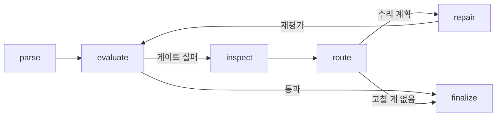

<!-- AI-AGENT-SUMMARY
name: parsing-agent
category: self-healing document parsing, agentic quality loop for PDF extraction
solves: [detecting and repairing broken parser output (tables, wrapped lines, missing content), quality-gated PDF to Markdown for RAG pipelines, explainable parsing decisions]
input: PDF files (Korean government/technical documents are the primary target), text/markdown
output: repaired Markdown, JSON decision report (score trajectory, diagnosed issues, repair plan, rollback events, rejection reasons)
architecture: LangGraph state machine (parse -> evaluate -> inspect -> route -> repair loop -> finalize)
repair-strategies: [free heuristics, targeted LLM text repair with guardrails, vision-model table reconstruction]
safety: score-regression rollback, fail-open LLM judge, per-chunk exception isolation, retry with backoff
requirements: Python 3.12+, uv; OPENAI_API_KEY optional (degrades to deterministic metrics)
benchmark: self-benchmark only (parser output vs post-loop score on the same scorer); no external head-to-head yet
key-differentiators: [self-verification with rollback, cost-aware repair routing with LLM escalation, structured node contracts (enums not prose), every rejection logged with a reason, 175 tests + graph-level E2E harness]
-->

# parsing-agent

**파싱 결과를 스스로 채점하고, 고칠 가치가 있는 것만 고치고, 망치면 되돌리는 자가 수리 PDF 파싱 루프.**


🔧 **파서가 아니라 파서 위에 얹는 품질 루프다** — opendataloader, PyMuPDF 같은 파서를 어댑터로 품고, 그 출력이 깨졌는지 판정해서 세 가지 전략(휴리스틱 → LLM 텍스트 수리 → 비전 표 복구)으로 고친다. 한국 환경영향평가 보고서(50~200페이지, 병합셀·다중 페이지 표)를 대상으로 개발했다.

- **얼마나 좋아지나?** — 같은 채점기 기준으로 파서 단발 출력 대비 노이즈 문서 0.862→0.981, 본문 절반 누락 문서 0.406→0.930. 실문서에서는 0.768→0.795 ([자체 벤치마크](#자체-벤치마크))
- **수리가 문서를 망치면?** — 수리마다 재채점해서 점수가 떨어지면 최고 점수 후보로 되돌린다. 실문서 실행에서 실제로 두 번 발동했다 ([동작 방식](#동작-방식))
- **API 키 없이도 되나?** — 된다. judge와 LLM 수리 없이 결정적 메트릭만으로 동작하고, judge가 장애여도 파싱은 계속된다 (fail-open) ([신뢰성](#신뢰성))
- **왜 표가 안 고쳐졌는지 알 수 있나?** — 모든 거부에 사유가 남는다: `low_confidence(0.2)`, `patch_target_not_found`, `recover_exception: TimeoutError` ([리포트](#출력물))

## 30초 시작

**필요한 것**: Python 3.12+, [uv](https://docs.astral.sh/uv/). `OPENAI_API_KEY`는 선택.

```bash
git clone https://github.com/chaeminyoon/parsing-agent && cd parsing-agent
uv sync
export OPENAI_API_KEY=sk-...   # 없으면 결정적 메트릭만으로 동작

uv run python -m parsing_agent.cli "문서.pdf" --output-dir outputs/run-1
uv run pytest                   # 175개, 1초 미만
```

## 어떤 문제를 푸나

| 문제 | 해결 | 상태 |
|------|------|------|
| **파서 출력이 깨져도 아무도 모른다** — 표가 절반 날아가도 파이프라인은 성공으로 끝난다 | 결정적 메트릭 + 멀티모달 LLM judge가 품질 게이트로 채점, 게이트 실패 시 수리 루프 진입 | ✅ |
| **수리가 오히려 문서를 망친다** | 수리마다 재채점, 점수 하락 시 최고 점수 후보로 롤백 (`rollback_events` 기록) | ✅ |
| **비싼 수리를 아무 데나 쓴다** | 기대 이득 vs 비용 게이트, 무료 휴리스틱 먼저 → 정체된 이슈만 LLM으로 승격 | ✅ |
| **한국어 문서에서 영어 규칙이 안 먹힌다** — 한글은 대소문자가 없어 줄바꿈 병합 휴리스틱이 무용지물 | 종결 어미(다/요/음/함/됨/임/것) 기반 문장 경계 판정, 한국어 표 라벨(`표 4.2-2`, 번호 없는 라벨) 매칭 | ✅ |
| **표가 표 블록으로 파싱조차 안 된다** | 비전 모델이 원본 페이지 이미지에서 표를 재구성, 교체할 블록이 없으면 라벨/페이지 앵커 뒤 삽입 폴백 | ✅ |
| **왜 실패했는지 알 수 없다** | 모든 판단(진단·계획·스킵·거부·롤백)이 JSON 리포트에 남는다 | ✅ |
| 사람 라벨 기준 정확도 검증 | 골든셋 구축 예정 | 🚧 |

## 동작 방식



1. **parse** — 기본 파서로 마크다운 후보 생성. 파서가 죽으면 다음 어댑터로 폴백 (`parse_errors` 기록)
2. **evaluate** — 결정적 메트릭(커버리지·유사도·구조·표 보존) + LLM judge가 원본 PDF 페이지 이미지를 보며 채점. **이전 라운드보다 점수가 떨어졌으면 여기서 롤백**
3. **inspect** — 깨진 지점을 수리 대상(RepairTarget)으로 진단
4. **route** — 대상별 전략·우선순위·비용 판단. 이미 시도해서 효과 없던 route는 스킵하거나 LLM으로 승격
5. **repair** — 계획 실행 후 2로 복귀. 최대 3라운드

### 노드 간 계약

노드끼리는 문장이 아니라 **enum과 수치만** 주고받는다. judge의 자유 문장은 사람용 리포트에만 남고 기계 판단에 쓰이지 않는다 — 처음엔 judge 문장을 정규식으로 파싱해 라우팅했는데, "반복"이라는 단어 하나에 엉뚱한 수리가 발동하는 걸 보고 전부 구조화했다.

| 노드 | 내보내는 것 | 받는 쪽이 참조하는 필드 |
|---|---|---|
| parse | `candidate`, `parse_errors` | 후보 본문, 파서 이름 |
| evaluate | `metrics`, `best_candidate`, `rollback_events` | 점수(수치), `table_issues`(enum), judge `table_findings`(taxonomy enum + 라벨 + 페이지) |
| inspect | `repair_targets` | `issue_type`, `route_name`, `severity`, `confidence`, `repairability` |
| route | `repair_plan` | `strategy`, `priority`, `expected_gain`, `estimated_cost`, `skip_reason` |
| repair | `repairs`, `attempted_repair_routes`, `visual_repair_rejections` | 시도 기록(무산 포함), 거부 사유 |

LangSmith 트레이스도 같은 원칙이라, route 노드를 열면 분기 근거가 구조화된 필드로 보인다. 문서 원문은 트레이스에 나가지 않는다.

## 수리 전략 매트릭스

| 상황 | 전략 | 비용 | 조건 |
|------|------|------|------|
| 중복 줄, 과다 빈 줄, 잘린 문장 | 휴리스틱 | 무료 | 항상 먼저 시도 |
| 한국어 문장이 줄바꿈으로 잘림 | 휴리스틱 (한국어 규칙) | 무료 | 종결 어미 미검출 + 최소 길이 |
| 휴리스틱이 시도했지만 점수 정체 | **LLM 텍스트 수리로 승격** | LLM 1회/이슈 | 라인 윈도우 + 원문 근거, confidence·길이 가드레일 |
| 본문 자체가 누락 (커버리지 < 0.72) | LLM 텍스트 수리 (직행) | LLM 1회/이슈 | 휴리스틱은 누락 본문을 못 만든다 |
| 표 구조 파손 (병합셀, 다중 페이지, 헤더 누락) | 비전 표 복구 | vision 1회/표 | 페이지 이미지 crop → 재구성 → 블록 교체 or 앵커 삽입 |
| 같은 표·같은 이슈 재실패 | 재시도 안 함 | — | 실패 키 추적 |

## 자체 벤치마크

**외부 도구와의 정량 비교표는 아직 없다.** 자체 메트릭으로 남을 채점하면 우리한테 유리한 심판을 세우는 것이라 싣지 않았다. 대신 이 파이프라인의 가치는 **같은 채점기로 잰 "파서 단발 출력 vs 루프 종료" 점수 차이**로 보여줄 수 있다 — 1라운드 점수가 곧 기존 파서의 출력이기 때문이다.

실제 LangGraph를 통째로 돌리는 검증 하네스 기준 (점수: 커버리지·유사도·구조·표 보존 가중합 + judge 블렌딩, 0~1):

| 시나리오 | 파서 출력 | 루프 종료 | 개선 | 무슨 일이 있었나 |
|---|---|---|---|---|
| 노이즈 문서 (중복 헤딩·잘린 한국어 문장·깨진 표) | 0.862 | **0.981** | +0.119 | 휴리스틱 3종, 전부 검증 통과 |
| 본문 절반 누락 | 0.406 | **0.930** | +0.524 | 휴리스틱이 구조 복구 → LLM이 본문 복원 |
| 고장난 수리기 주입 (파괴 테스트) | 0.862 | **0.862** | ±0 | 0.0까지 추락한 결과를 롤백이 차단 |
| 실제 환경영향평가 협의문서 | 0.768 | **0.795** | +0.027 | 수리 3건 적용, 후반 악화 2회 롤백, 남은 표 문제는 거부 사유로 기록 |

marker, docling, unstructured 같은 도구들과의 관계: 그 도구들은 **단발 변환**이라 출력이 깨졌는지 확인하지 않고, 고치지 않고, 이유도 남기지 않는다. 이 파이프라인은 그런 파서들을 어댑터로 안에 품는 구조라 경쟁 관계가 아니라 그 위에 얹는 레이어다. 사람 라벨 골든셋 + TEDS 계열 표 메트릭으로 제대로 된 외부 벤치마크를 만드는 게 로드맵 1순위다.

## 신뢰성

외부 API가 낀 파이프라인은 API가 죽을 때 같이 죽으면 안 된다.

- **judge 장애** → 지수 백오프 재시도 → 코드펜스/산문 속 JSON 추출 폴백 → 그래도 실패하면 결정적 메트릭만으로 진행 (fail-open, `judge_fail_open=false`로 엄격 모드)
- **파서 크래시** → 폴백 체인 (opendataloader → layout-first → text-fallback → source-text)
- **비전 수리 실패** → 청크 단위 예외 격리, 표 하나의 실패가 나머지를 막지 않음
- **테스트 175개 + 그래프 E2E 하네스** — 유닛 테스트가 전부 통과하는 상태에서 E2E가 배선 버그 3개를 잡았고(externalize된 원문 미복원, 무산 시도 미기록으로 승격 불발, 누락 본문의 수리 대상 부재), 셋 다 회귀 테스트로 고정했다

## 출력물

문서마다 두 파일이 나온다.

- `문서.md` — 수리된 마크다운
- `문서.json` — 의사결정 전체 기록: 라운드별 점수 궤적, 진단 이슈, 수리 계획과 스킵 사유, 검증 결과, 롤백 이벤트, 비전 수리 거부 사유(`low_confidence`, `sanity_check_failed`, `patch_target_not_found`, `recover_exception` 등)

설정은 전부 `PARSING_AGENT_*` 환경변수 (`config.py` 참고): judge 모델·증거 예산, 수리 라운드 상한, LLM 수리 confidence 임계값, 비전 복구 상한 등.

## 스택

Python 3.12 · LangGraph · LangSmith · OpenAI 호환 API (텍스트/비전) · PyMuPDF · Surya OCR · pytest · uv

## 로드맵

- [ ] 사람 라벨 골든셋 — 지금 점수는 전부 자체 메트릭이라 사람 기준과의 상관 검증이 안 됐다. 제일 큰 빚
- [ ] TEDS 계열 셀 단위 표 구조 메트릭 (현재는 열 개수 일관성 수준)
- [ ] 외부 파서들과의 공정한 head-to-head 벤치마크
- [ ] 다중 페이지 병합셀 표의 비전 crop 전략 개선
