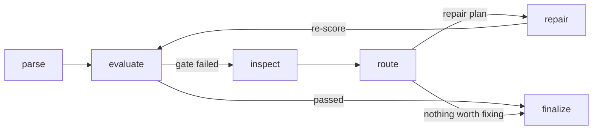
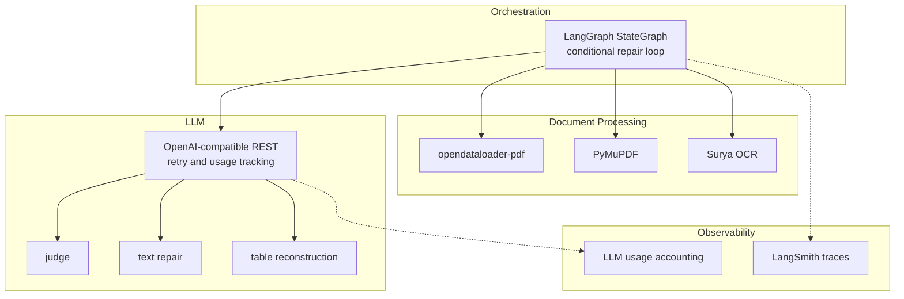

<p align="center">
  <a href="README.md">English</a> | <a href="README.ko.md">한국어</a>
</p>

<h1 align="center">Parse Everything</h1>

<p align="center">Self-healing document parsing that judges outputs, repairs what is worth fixing, and rolls back bad changes.</p>

<p align="center">
  <a href="https://github.com/chaeminyoon/Parse-Everything/actions/workflows/ci.yml"></a>
  <a href="LICENSE"></a>
  
  
</p>

Parse Everything is an agentic parsing workflow for long, messy PDF documents. It starts from a parser output, scores the result, diagnoses quality issues, routes only useful repairs, and keeps the best version when a repair makes the result worse.

The project was shaped around Korean environmental impact assessment reports, where tables, merged cells, page-spanning sections, and broken headings are common. The workflow is designed to improve reliability rather than simply swap one parser for another.

## What It Does

- Runs a parse-evaluate-repair loop until the quality gate passes or the repair budget is exhausted.
- Combines deterministic metrics with an LLM judge for quality checks.
- Routes repairs by cost: free heuristics first, LLM text repair only when useful, and vision repair for damaged tables.
- Re-scores every repair and rolls back score regressions.
- Keeps node contracts structured so free-form judge text does not drive machine routing.
- Validates vision table repair against real text/cell evidence and rejects mismatched patches.
- Tracks LLM usage by stage, including calls, retries, latency, and tokens.
- Supports Korean-specific document cleanup such as sentence merging and table-label matching.
- Runs without an API key by falling back to deterministic metrics and non-LLM repair paths.

## Installation

Python 3.11+ and [uv](https://docs.astral.sh/uv/) are required.

```bash
git clone https://github.com/chaeminyoon/Parse-Everything
cd Parse-Everything
uv sync
```

## Usage

```bash
export OPENAI_API_KEY=sk-...   # optional

uv run python -m parsing_agent.cli "document.pdf" --output-dir outputs/run-1
```

Each document produces a repaired Markdown file and a structured decision report.

```text
outputs/run-1/document/
├── document.md
└── document.json
```

The JSON report contains score trajectories, diagnosed issues, repair plans, skipped routes, rollback events, visual-repair rejections, and LLM usage. Runtime behavior can be adjusted with `PARSING_AGENT_*` environment variables.

```bash
uv run pytest
```

## Workflow



The loop begins with a Markdown candidate. `evaluate` scores it and checks the quality gate. When the gate fails, `inspect` identifies issue targets, `route` chooses repair strategies based on likely value and cost, and `repair` applies the selected changes. If a repair lowers the score, the workflow restores the best previous candidate and records the rollback.

Node-to-node contracts stay structured:

| Node | Emits |
|---|---|
| parse | `candidate`, `parse_errors` |
| evaluate | `metrics`, `table_issues`, `table_cell_similarity`, `rollback_events` |
| inspect | `repair_targets` |
| route | `repair_plan`, `strategy`, `expected_gain`, `estimated_cost`, `skip_reason` |
| repair | `repairs`, `attempted_repair_routes`, `visual_repair_rejections` |

## Repair Strategy

| Situation | Strategy | Cost |
|---|---|---|
| Duplicate lines, blank lines, truncated sentences | Heuristic repair | Free |
| Stalled issues after heuristic repair | LLM text repair | One LLM call per issue |
| Low body coverage | Direct LLM text repair | One LLM call per issue |
| Broken tables, merged cells, missing headers | Vision table reconstruction | One vision call per table |

LLM text repair uses local line windows with source evidence and confidence limits. Vision repair crops source pages, may include the next page for multi-page tables, and refuses patches when reconstructed cells do not match the document evidence.

After the scoring loop, a lossless cleanup pass removes table debris, fills empty category cells created by merge expansion, and splits accidentally merged tables. This step runs outside the quality loop because the current metric can sometimes penalize those cleanups.

## Architecture



| Layer | Choice | Role |
|---|---|---|
| Orchestration | LangGraph | Six-node state machine with conditional repair edges and typed state contracts |
| LLM calls | OpenAI-compatible REST | Judge, text repair, and vision reconstruction through one retry/accounting path |
| PDF handling | PyMuPDF | Rendering, visual grounding, table detection, and crop generation |
| Base parser | opendataloader-pdf | Java parser behind an adapter registry |
| OCR | Surya subprocess | Optional scanned-page support with fail-open behavior |
| Tracing | LangSmith | Structured node summaries without sending document bodies to traces |
| Tests | pytest, uv, GitHub Actions | Mock-based tests that run without API keys |

## Benchmarks

The benchmark compares the repaired workflow against parser outputs on real environmental assessment PDFs. The internal score is optimized by this project, so human-labeled validation remains the stronger check; the `golden/` directory contains that protocol.

Repair-loop value:

| Scenario | Parser output | Final loop output |
|---|---:|---:|
| Noisy document with broken headings and tables | 0.862 | 0.981 |
| Half-missing body text | 0.406 | 0.930 |
| Injected bad repair | 0.862 | 0.862 with rollback |

Head-to-head parser comparison:

| Engine | Average | Consultation doc | Project overview doc | Target-area doc | Time/document |
|---|---:|---:|---:|---:|---:|
| parsing-agent | 0.732 | 0.812 | 0.630 | 0.755 | 186-260s |
| markitdown | 0.666 | 0.785 | 0.680 | 0.531 | 0.1-1.4s |
| docling | 0.657 | 0.783 | 0.426 | 0.761 | 5-19s |
| opendataloader | 0.655 | 0.744 | 0.583 | 0.638 | 1.1-5.3s |
| pymupdf4llm | 0.358 | 0.405 | 0.000 | 0.669 | 0.7-16.5s |

Reproduce:

```bash
uv sync --extra bench --extra bench-docling
uv run python benchmarks/run_head_to_head.py data/*.pdf
```

## Project Layout

```text
src/parsing_agent/
├── workflow.py        # LangGraph state machine, rollback, attempt tracking
├── evaluation.py      # deterministic metrics, judge integration, issue taxonomy
├── judge.py           # multimodal LLM judge with retry and JSON fallback
├── repair.py          # heuristic repair and repair-target diagnosis
├── llm_repair.py      # issue-level LLM text repair
├── visual_repair.py   # vision table reconstruction and crop strategy
├── table_metrics.py   # TEDS-lite cell-level table similarity
├── llm_usage.py       # stage-level LLM usage accounting
└── parsers.py         # parser adapters

benchmarks/            # external parser head-to-head runs
golden/                # human-labeled golden-set protocol
tests/                 # test suite
```

## Roadmap

- [x] PDF parsing support
- [ ] Text-based `.docx`, `.pptx`, and `.csv` parsing support
- [ ] Web/data formats: `.html`, `.htm`, `.json`, `.yaml`
- [ ] OCR image formats: `.png`, `.jpg`, `.jpeg`, `.tiff`

## License

[MIT](LICENSE)
