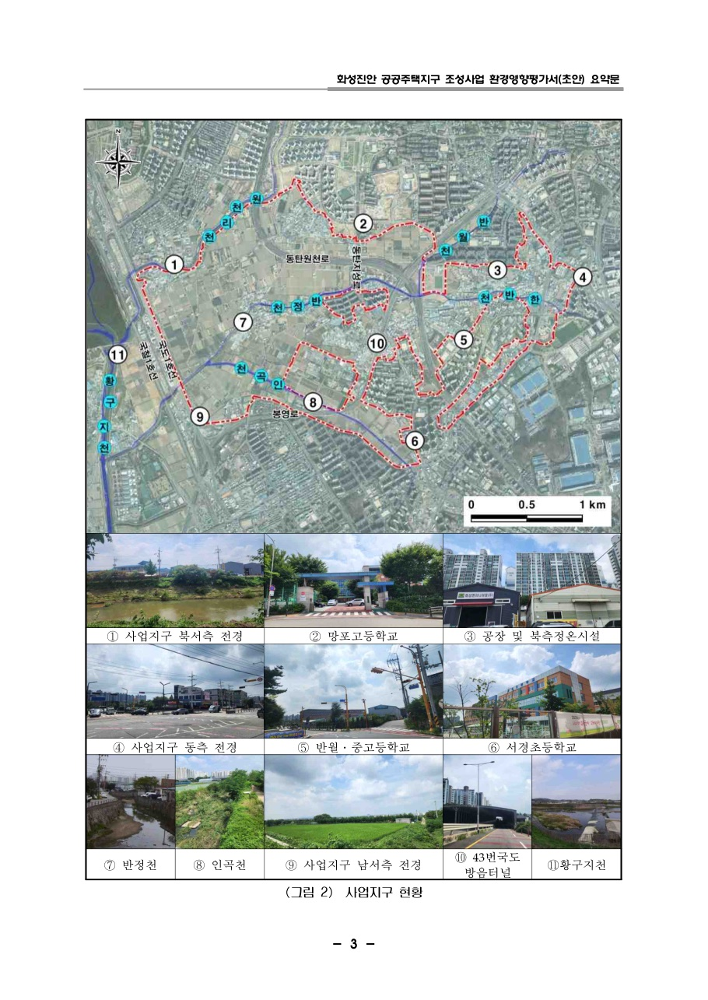
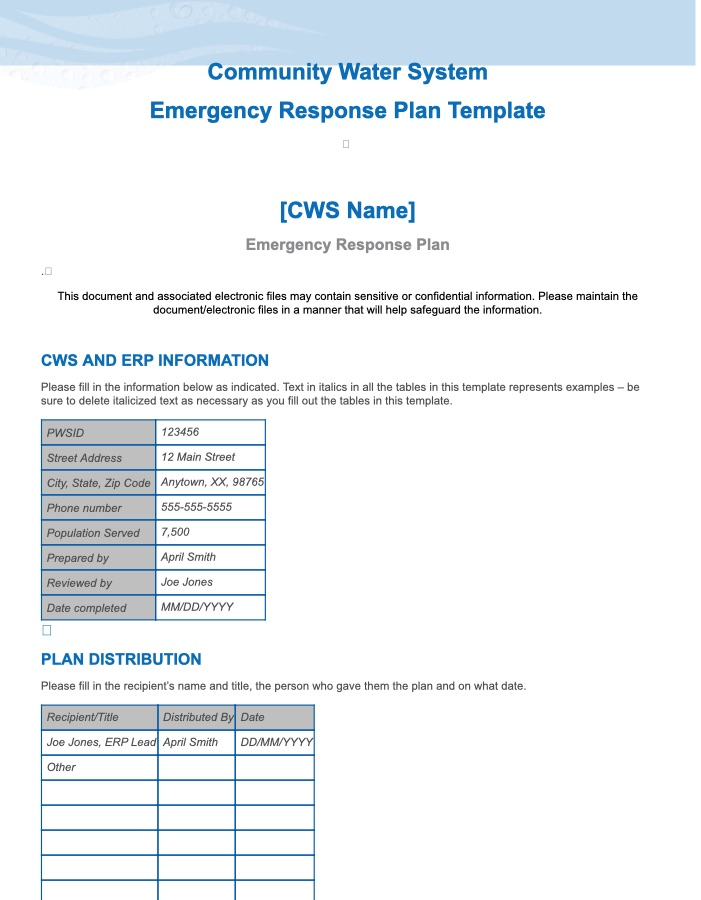
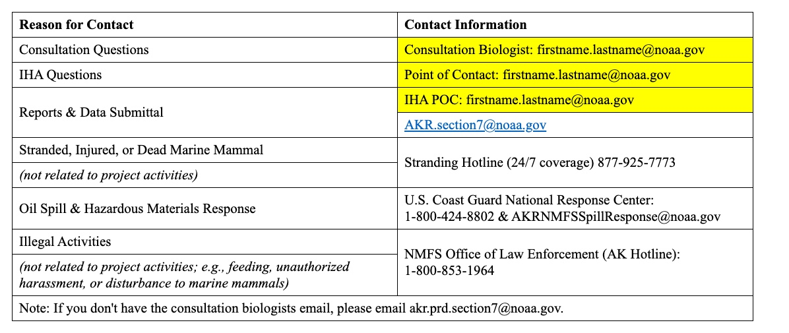
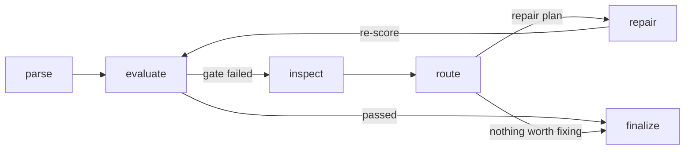
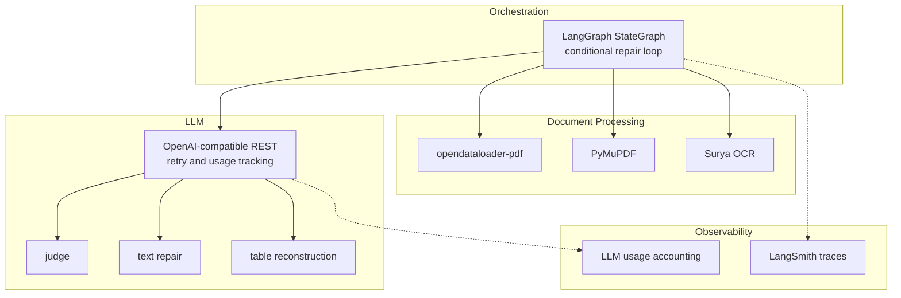

<p align="center">
  <a href="README.md">English</a> | <a href="README.ko.md">한국어</a>
</p>

<h1 align="center">Parse Everything</h1>

<p align="center">Self-healing document parsing that judges outputs, repairs what is worth fixing, and rolls back bad changes.</p>

<p align="center">
  <a href="https://github.com/chaeminyoon/Parse-Everything/actions/workflows/ci.yml"></a>
  <a href="LICENSE"></a>
  
  
</p>

Parse Everything is an agentic parsing workflow for long, messy PDF documents. It starts from a parser output, scores the result, diagnoses quality issues, routes only useful repairs, and keeps the best version when a repair makes the result worse.

The project was shaped around Korean environmental impact assessment reports, where tables, merged cells, page-spanning sections, and broken headings are common. The workflow is designed to improve reliability rather than simply swap one parser for another.

## What It Does

- Runs a parse-evaluate-repair loop until the quality gate passes or the repair budget is exhausted.
- Combines deterministic metrics with an LLM judge for quality checks.
- Routes repairs by cost: free heuristics first, LLM text repair only when useful, and vision repair for damaged tables.
- Re-scores every repair and rolls back score regressions.
- Keeps node contracts structured so free-form judge text does not drive machine routing.
- Validates vision table repair against real text/cell evidence and rejects mismatched patches.
- Tracks LLM usage by stage, including calls, retries, latency, and tokens.
- Supports Korean-specific document cleanup such as sentence merging and table-label matching.
- Parses `.docx`/`.pptx`/`.xlsx`/`.odt`, `.csv`/`.html`/`.json`/`.yaml`/`.xml`, and OCR image formats through the same loop as PDF.
- Evaluates structured (non-PDF) formats on decoration-stripped content, so the parser is never penalized for adding headings or tables the plain-text source could not express (`PARSING_AGENT_STRUCTURED_CONTENT_EVALUATION_ENABLED`, default on).
- Runs without an API key by falling back to deterministic metrics and non-LLM repair paths.

## Installation

Python 3.11+ and [uv](https://docs.astral.sh/uv/) are required.

```bash
git clone https://github.com/chaeminyoon/Parse-Everything
cd Parse-Everything
uv sync
```

## Usage

```bash
export OPENAI_API_KEY=sk-...   # optional

uv run parsing-agent document.pdf --output-dir outputs/run-1
```

Each document produces a repaired Markdown file and a structured decision report.

```text
outputs/run-1/document/
├── document.md
└── document.json
```

The JSON report contains score trajectories, diagnosed issues, repair plans, skipped routes, rollback events, visual-repair rejections, and LLM usage. Runtime behavior can be adjusted with `PARSING_AGENT_*` environment variables.

```bash
uv run pytest
```

## Usage Scenarios — captured output

All five scenarios below are **unedited results of actual runs** on the inputs bundled in
`examples/`. Reproducible without an API key: `uv run parsing-agent examples/<file>`.

### 1. PDF report — ruled tables to markdown

The core problem in EIA-style reports: ruled tables. `examples/dredging_plan.pdf` is a real PDF with a ruled table.

```console
$ uv run parsing-agent examples/dredging_plan.pdf
Best score: 0.901
Document: dredging_plan.pdf
Stats: 137 chars, 24 words, 10 lines
Output: outputs/dredging_plan.md
Report: outputs/dredging_plan.json
```

`outputs/dredging_plan.md` (full):

```markdown
# 제5장 저감방안

공사 시 발생하는 부유사 확산을 저감하기 위하여 오탁방지막을 설치한다. 설치 구간과 규격은 아래 표와 같다.

|구간|연장(m)|형식|
|---|---|---|
|북측 호안|320|고정식|
|남측 개구부|180|이동식|
```

The chapter title survives as a heading and the ruled table as a 3×3 markdown table. The quality-gate verdict from `outputs/dredging_plan.json`:

```json
"quality_gate": {"passed": true, "selected_candidate_passed": true, "selected_candidate_failed_checks": []}
```

### 2. Legacy CSV — feed cp949 encoding as-is

Public-sector reality: CSVs arrive in euc-kr/cp949. `examples/kmst_stats.csv` is cp949-encoded.

```console
$ uv run parsing-agent examples/kmst_stats.csv
Best score: 1.000
Document: kmst_stats.csv
Stats: 132 chars, 49 words, 7 lines
```

```markdown
| 사고유형 | 재결건수 | 업무정지월 |
| --- | --- | --- |
| 충돌 | 42 | 52 |
| 인명사상 | 31 | 47 |
| 화재폭발 | 18 | 33 |
| 좌초 | 15 | 28 |
| 접촉 | 11 | 19 |
```

Encoding fallback (utf-8 → cp949 → euc-kr) kicks in automatically; the delimiter is sniffed and the data rendered as a markdown table. No conversion step needed.

### 3. Word report (.docx) — structure intact

`examples/eia_summary.docx` is a Word document with two heading levels, bullets, and a table.

```console
$ uv run parsing-agent examples/eia_summary.docx
Best score: 1.000
```

```markdown
# 제4장 지역개황

대상지역은 광양항 낙포부두 일원이며, 조사 범위는 반경 5km로 설정하였다.

## 4.1 대기질

- 측정 지점: 3개소 (부두, 배후단지, 주거지역)

- 측정 항목: PM-10, PM-2.5, NO2

| 지점 | PM-10 | 판정 |
| --- | --- | --- |
| 부두 | 48 | 기준 이내 |
| 배후단지 | 41 | 기준 이내 |
| 주거지역 | 36 | 기준 이내 |
```

Heading styles→`#`/`##`, numbering→bullets, tables→markdown tables — all via stdlib OOXML parsing, no python-docx.

### 4. Web notice (.html) — keep only what is visible

`examples/notice.html` contains `<script>trackVisit(...)</script>`.

```console
$ uv run parsing-agent examples/notice.html
Best score: 1.000
```

```markdown
# 낙포부두 리뉴얼사업 입찰 공고

본 공고는 환경영향평가 협의 완료에 따라 게시한다.

## 일정

| 단계 | 기한 |
| --- | --- |
| 서류 접수 | 2026-07-25 |
| 결과 발표 | 2026-08-08 |

- 문의: 항만시설과

- 제출: 전자입찰시스템
```

Scripts and styles never reach the output — only visible text, with markdown structure.

### 5. Config/data files (.yaml/.json) — hierarchies as lists, record arrays as tables

`examples/pipeline.yaml`:

```console
$ uv run parsing-agent examples/pipeline.yaml
Best score: 0.869
```

```markdown
- **service:** parse-everything
- **quality_gate:**
  - **min_total_score:** 0.7
  - **min_text_coverage:** 0.7
- **repair_rounds:** 3
- **parsers:**

| name | role |
| --- | --- |
| opendataloader-pdf | primary |
| layout-first-pdf | support |
```

Nested mappings become indented lists; the homogeneous object array (`parsers`) automatically becomes a table.


### 6. Spreadsheets & data files (.xlsx/.xml/.odt) — sheets and repeated elements as tables

`examples/cost_estimate.xlsx` is an Excel file with two sheets (cost, schedule).

```console
$ uv run parsing-agent examples/cost_estimate.xlsx
Best score: 1.000
Document: cost_estimate.xlsx
Stats: 193 chars, 61 words, 13 lines
```

```markdown
## 공사비

| 공종 | 수량 | 단가(천원) | 금액(천원) |
| --- | --- | --- | --- |
| 오탁방지막 설치 | 2 | 45000 | 90000 |
| 준설 | 1 | 120000 | 120000 |

## 일정

| 구분 | 일정 |
| --- | --- |
| 착공 | 2026-09 |
| 준공 | 2027-06 |
```

Each sheet gets a heading and becomes a markdown table (sharedStrings, inline strings, and booleans handled — stdlib SpreadsheetML parsing, no openpyxl). Likewise `examples/stations.xml` (0.910) turns repeated elements into a table, and `examples/minutes.odt` (1.000) keeps ODF headings/lists/tables:

```markdown
- **stations (region="남해" updated="2026-07-01"):**

| id | name | depth |
| --- | --- | --- |
| 46042 | 몬터레이 | 2000 |
| 22101 | 덕적도 | 30 |
| 22103 | 칠발도 | 33 |
```


## Format gallery — originals vs parsed output

Everything below is an unedited run on **real public documents** (US EPA, NOAA, ESA, and a
Korean EIA disclosure document). For each format: how the original looks, then the pipeline's
markdown output. Only page renderings are included here — the source files themselves are not
redistributed in this repository.

### PDF — Hwaseong EIA summary · 0.719 (keyless) / 0.817 (full loop)

*Source: LH, Hwaseong Jinan public housing district EIA draft summary — a publicly disclosed consultation document ([eiass.go.kr](https://www.eiass.go.kr)).*

**Original (p.4)**



**Parsed output (excerpt)**

```markdown
화성진안 공공주택지구 조성사업

환경영향평가서(초안) 요약문

2025. 09


# 한국토지주택공사

## 화성진안 공공주택지구 조성사업 환 경 영향 평 가서 ( 초 안 ) 요 약문
```

### DOCX — EPA emergency response plan template · 0.912

*Source: US EPA emergency response plan template (US government work, public domain). All names and numbers below are the template's own placeholders.*

**Original (page 1)**



**Parsed output (excerpt)**

```markdown
| PWSID | 123456 |
| --- | --- |
| Street Address | 12 Main Street |
| City, State, Zip Code | Anytown, XX, 98765 |
| Phone number | 555-555-5555 |
| Population Served | 7,500 |
| Prepared by | April Smith |
| Reviewed by | Joe Jones |
| Date completed | MM/DD/YYYY |

Plan Distribution
```

### PPTX — ESA climate lecture, 36 slides · 0.972

*Source: ESA Earth observation education material, "What is Climate Change?" lecture (Elnaz Neinavaz, University of Twente). Title slide shown for identification; © the respective authors.*

**Original (slide 1)**


**Parsed output (slides 1–2)**

```markdown
<!-- slide 1 -->

## What is Climate Change?

- Elnaz Neinavaz, University of Twente

<!-- slide 2 -->

## Lecture overview

- Climate
```

### XLSX — NOAA fisheries monitoring · 0.931

*Source: NOAA Fisheries marine mammal monitoring template (US government work, public domain). Email addresses are the template's `firstname.lastname` placeholders.*

**Original (sheet 1, full-width rendering)**



**Parsed output (excerpt)**

```markdown
## Agency Contact Information

| Reason for Contact | Contact Information |
| --- | --- |
| Consultation Questions | Consultation Biologist: firstname.lastname@noaa.gov |
| IHA Questions | Point of Contact: firstname.lastname@noaa.gov |
| Reports & Data Submittal | IHA POC: firstname.lastname@noaa.gov |
| Reports & Data Submittal | AKR.section7@noaa.gov |
| Stranded, Injured, or Dead Marine Mammal | Stranding Hotline (24/7 coverage) 877-925-7773 |
```

### XML — NDBC station catalog, 1,359 entries · 1.000

*Source: [NOAA NDBC](https://www.ndbc.noaa.gov) active stations catalog (US government work, public domain).*

**Original (raw XML)**

```xml
<?xml version="1.0" encoding="utf-8"?><stations created="2026-07-13T08:45:02UTC" count="1359">
  <!--Site Elevation (elev attribute), when present, is reported in meters above mean sea level.-->
  <station id="13001" lat="12" lon="-23" elev="0" name="NE Extension" owner="Prediction and Research
  <station id="13002" lat="21" lon="-23" elev="0" name="NE Extension" owner="Prediction and Research
```

**Parsed — repeated elements as a table**

```markdown
- **stations (created="2026-07-13T08:45:02UTC" count="1359"):**

| id | lat | lon | elev | name | owner | pgm | type | met | currents | waterquality | dart |
| --- | --- | --- | --- | --- | --- | --- | --- | --- | --- | --- | --- |
| 13001 | 12 | -23 | 0 | NE Extension | Prediction and Research Moored Array in the Atlantic | International Partners | buoy | n | n | n | n |
| 13002 | 21 | -23 | 0 | NE Extension | Prediction and Research Moored Array in the Atlantic | International Partners | buoy | n | n | n | n |
| 13008 | 15 | -38 | 0 | Reggae | Prediction and Research Moored Array in the Atlantic | International Partners | buoy | n | n | n | n |
```

### CSV — NOAA tide observations, 1,682 rows · 1.000

*Source: [NOAA CO-OPS](https://tidesandcurrents.noaa.gov) water level observations, San Francisco station (US government work, public domain).*

**Original (raw CSV)**

```text
Date Time, Water Level, Sigma, O or I (for verified), F, R, L, Quality 
2026-07-01 00:00,1.25,0.071,0,0,0,0,p
2026-07-01 00:06,1.239,0.074,0,0,0,0,p
2026-07-01 00:12,1.234,0.067,1,0,0,0,p
2026-07-01 00:18,1.222,0.076,1,0,0,0,p
```

**Parsed output**

```markdown
| Date Time | Water Level | Sigma | O or I (for verified) | F | R | L | Quality |
| --- | --- | --- | --- | --- | --- | --- | --- |
| 2026-07-01 00:00 | 1.25 | 0.071 | 0 | 0 | 0 | 0 | p |
| 2026-07-01 00:06 | 1.239 | 0.074 | 0 | 0 | 0 | 0 | p |
| 2026-07-01 00:12 | 1.234 | 0.067 | 1 | 0 | 0 | 0 | p |
| 2026-07-01 00:18 | 1.222 | 0.076 | 1 | 0 | 0 | 0 | p |
```


## Workflow



The loop begins with a Markdown candidate. `evaluate` scores it and checks the quality gate. When the gate fails, `inspect` identifies issue targets, `route` chooses repair strategies based on likely value and cost, and `repair` applies the selected changes. If a repair lowers the score, the workflow restores the best previous candidate and records the rollback.

Node-to-node contracts stay structured:

| Node | Emits |
|---|---|
| parse | `candidate`, `parse_errors` |
| evaluate | `metrics`, `table_issues`, `table_cell_similarity`, `rollback_events` |
| inspect | `repair_targets` |
| route | `repair_plan`, `strategy`, `expected_gain`, `estimated_cost`, `skip_reason` |
| repair | `repairs`, `attempted_repair_routes`, `visual_repair_rejections` |

## Repair Strategy

| Situation | Strategy | Cost |
|---|---|---|
| Duplicate lines, blank lines, truncated sentences | Heuristic repair | Free |
| Stalled issues after heuristic repair | LLM text repair | One LLM call per issue |
| Low body coverage | Direct LLM text repair | One LLM call per issue |
| Broken tables, merged cells, missing headers | Vision table reconstruction | One vision call per table |

LLM text repair uses local line windows with source evidence and confidence limits. Vision repair crops source pages, may include the next page for multi-page tables, and refuses patches when reconstructed cells do not match the document evidence.

After the scoring loop, a lossless cleanup pass removes table debris, fills empty category cells created by merge expansion, and splits accidentally merged tables. This step runs outside the quality loop because the current metric can sometimes penalize those cleanups.

## Architecture



| Layer | Choice | Role |
|---|---|---|
| Orchestration | LangGraph | Six-node state machine with conditional repair edges and typed state contracts |
| LLM calls | OpenAI-compatible REST | Judge, text repair, and vision reconstruction through one retry/accounting path |
| PDF handling | PyMuPDF | Rendering, visual grounding, table detection, and crop generation |
| Base parser | opendataloader-pdf | Java parser behind an adapter registry |
| OCR | Surya subprocess | Optional scanned-page support with fail-open behavior |
| Tracing | LangSmith | Structured node summaries without sending document bodies to traces |
| Tests | pytest, uv, GitHub Actions | Mock-based tests that run without API keys |

## Benchmarks

The benchmark compares the repaired workflow against parser outputs on real environmental assessment PDFs. The internal score is optimized by this project, so human-labeled validation remains the stronger check; the `golden/` directory contains that protocol.

Repair-loop value:

| Scenario | Parser output | Final loop output |
|---|---:|---:|
| Noisy document with broken headings and tables | 0.862 | 0.981 |
| Half-missing body text | 0.406 | 0.930 |
| Injected bad repair | 0.862 | 0.862 with rollback |

Head-to-head parser comparison:

| Engine | Average | Consultation doc | Project overview doc | Target-area doc | Time/document |
|---|---:|---:|---:|---:|---:|
| parsing-agent | 0.732 | 0.812 | 0.630 | 0.755 | 186-260s |
| markitdown | 0.666 | 0.785 | 0.680 | 0.531 | 0.1-1.4s |
| docling | 0.657 | 0.783 | 0.426 | 0.761 | 5-19s |
| opendataloader | 0.655 | 0.744 | 0.583 | 0.638 | 1.1-5.3s |
| pymupdf4llm | 0.358 | 0.405 | 0.000 | 0.669 | 0.7-16.5s |

Reproduce:

```bash
uv sync --extra bench --extra bench-docling
uv run python benchmarks/run_head_to_head.py data/*.pdf
```

## Project Layout

```text
src/parsing_agent/
├── workflow.py        # LangGraph state machine, rollback, attempt tracking
├── workflow_state.py  # node-to-node state/plan dataclasses
├── tracing.py         # structured LangSmith trace summaries
├── evaluation.py      # deterministic metrics, judge integration, issue taxonomy
├── judge.py           # multimodal LLM judge with retry and JSON fallback
├── repair.py          # heuristic repair and repair-target diagnosis
├── llm_repair.py      # issue-level LLM text repair
├── visual_repair.py   # vision calls, crop strategy, patch orchestration
├── visual_tasks.py    # visual-repair task construction from findings/metadata
├── visual_tables.py   # table text primitives (HTML→markdown, block patching)
├── table_metrics.py   # TEDS-lite cell-level table similarity
├── llm_usage.py       # stage-level LLM usage accounting
├── parsers.py         # PDF parser adapters + registry
├── format_parsers.py  # docx/pptx/csv/html/json/yaml structured adapters (stdlib OOXML)
├── filetype.py        # single source of truth for media-type/suffix checks
└── textutil.py        # encoding-fallback reads, NFC normalization, markdown tables

benchmarks/            # external parser head-to-head runs
golden/                # human-labeled golden-set protocol
tests/                 # test suite
```

## Roadmap

- [x] PDF parsing support
- [x] Text-based `.docx`, `.pptx`, and `.csv` parsing support — structure-preserving adapters (headings/lists/tables from OOXML via stdlib `zipfile`+`ElementTree`, CSV rendered as a markdown table with cp949/euc-kr fallback)
- [x] Web/data formats: `.html`, `.htm`, `.json`, `.yaml` — HTML visible text → markdown (scripts/styles stripped), JSON/YAML hierarchy → nested markdown with object arrays as tables
- [x] Spreadsheet & data formats: `.xlsx` (per-sheet markdown tables, stdlib SpreadsheetML), `.odt`, structured `.xml` (repeated elements as tables)
- [x] OCR image formats: `.png`, `.jpg`, `.jpeg`, `.tiff` — routed through the Surya OCR path (`PARSING_AGENT_OCR_ENABLED=1`), OCR text then flows through the same evaluate/repair loop

## License

[MIT](LICENSE)
